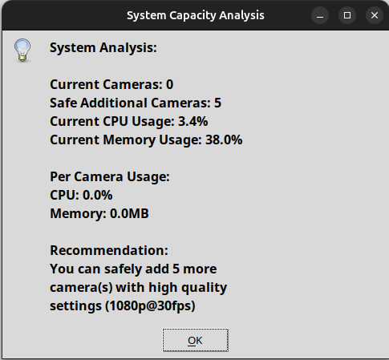

# Smart Camera Manager - Visual Guide

This visual guide provides an overview of the Smart Camera Manager's key features and interfaces. Each screenshot demonstrates different aspects of the system's functionality.

_Version: 1.0.0_  
_Last Updated: DECEMBER 22, 2024_

## Main Interface

The main interface provides a comprehensive view of all connected cameras and their controls. Key elements include:
- Camera list on the left
- Live preview windows
- Control buttons for recording and stream management
- Status indicators for each camera

## Camera Feed Preview

Individual camera feed preview showing:
- Real-time video stream
- FPS counter
- Resolution information
- Connection status

## Settings Configuration

The settings panel allows users to configure:
- Camera properties
- Recording parameters
- Video quality settings
- Storage locations

## Face Detection Demonstration

Example of the face detection feature:
- Real-time face detection
- Detection boundaries
- Processing status
- Detection confidence levels

## Performance Monitoring

The performance monitoring interface shows:
- CPU usage per camera
- Memory utilization
- Frame processing rates
- System load indicators

## Recording Settings

Configure recording parameters including:
- Video quality
- Segment duration
- Codec selection
- Storage management

## Multi-Camera View

The multi-camera view demonstrates:
- Simultaneous camera feeds
- Grid layout
- Performance optimization
- Stream synchronization

## System Resources

Monitor system resource utilization:
- Overall CPU usage
- Memory allocation
- Disk usage
- Network bandwidth

## Using These Examples

These screenshots serve as a reference for:
1. Understanding the user interface layout
2. Learning system capabilities
3. Configuring camera settings
4. Monitoring system performance

For detailed instructions on using each feature, please refer to the [User Guide](../guides/user_guide.md). 